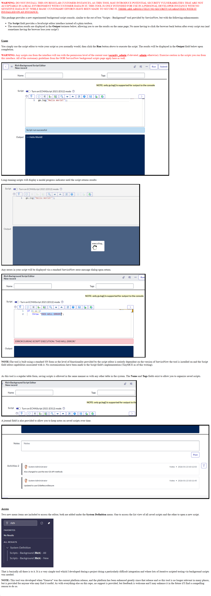

[//]: # (Because markdown is annoyingly limited, and GitHub won't just render an HTML file, we're forced to do stupid things like this - making a giant screenshot of the HTML and then including an image of it in a .md file)

